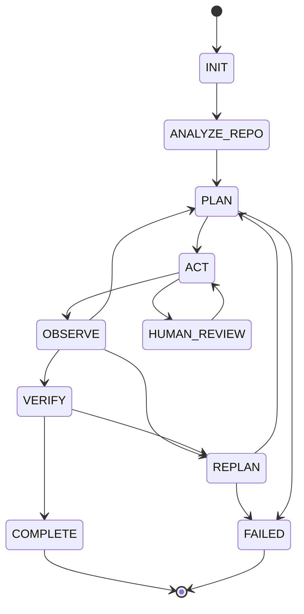

# repo-engineer: Autonomous Repository Engineer

A verified tool-using coding agent. Given a small repository and an engineering
task, it inspects the repo, plans, edits files through validated tools, runs
the test suite, observes failures, replans, and only declares success when the
verification suite is green.

```
INIT -> ANALYZE_REPO -> PLAN -> ACT -> OBSERVE -+-> PLAN (next step)
                                                |-> REPLAN (tests failed)
                                                +-> VERIFY -> COMPLETE / FAILED
```

The core design rule: **the planner proposes, the runtime disposes.** The LLM
(or scripted policy) only ever emits tool-call proposals. A deterministic state
machine validates every call against a schema, checks permissions, jails every
path inside the workspace, enforces step/replan budgets, and trusts nothing
except the test suite.

## Why it matters

Most "AI agent" demos break in one of three ways: they parse free-text tool
calls until the model hallucinates a syntax error, they give the model a shell
prompt, or they accept the model's word that the bug is fixed. This project
addresses all three explicitly:

| Failure mode | Defense in this repo |
|---|---|
| Malformed tool call | `ToolSpec` schema validation; rejects with structured errors recorded in the trace |
| Arbitrary shell access | no shell tool; `run_tests` allowlists command prefixes, runs without a shell, with timeout |
| Unverified claims | VERIFY state re-runs the suite; COMPLETE requires `exit=0` evidence |
| Path escapes / prompt injection via file content | workspace jail on every path argument; tool outputs are data, never instructions |
| Infinite loops | step budget + replan budget -> FAILED |

## Key results (measured, reproducible)

`python scripts/run_benchmark.py` runs four software-engineering tasks in
isolated workspace copies with the deterministic planner:

| task | success | steps | replans | failed tool calls |
|---|---|---|---|---|
| fix off-by-one loop | yes | 5 | 0 | 0 |
| repair failing test | yes | 5 | 1 | 0 |
| add missing test | yes | 5 | 0 | 0 |
| constrained refactor | yes | 7 | 0 | 0 |

Success rate 4/4. The committed `results/benchmark_results.json` is the output
of a real run; the traces in `runs/` show every tool call and observation.

## Architecture



Components (src/repo_engineer/):

- `state.py` - `State` enum, legal-transition table, serializable `AgentState`,
  `StateMachine` with step/replan budgets.
- `tools.py` - `ToolSpec` schema + `ToolRegistry`: `list_tree`, `search`,
  `read_file`, `apply_edit`, `write_file`, `git_diff`, `run_tests`. Permission
  classes (READ_ONLY / MUTATING / EXECUTION) with AUTO / ASK / DENY policies,
  workspace path jail, test-command allowlist, subprocess timeouts.
- `planner.py` - `Planner` ABC; `ScriptedPlanner` (deterministic recipes, used
  by the benchmark) and `LLMPlanner` (documented stub that requires explicit
  environment configuration).
- `agent.py` - `AgentRuntime`: the loop described above, plus JSON trace export.
- `benchmark/harness.py` + `benchmark/tasks/` - four self-contained mini-repos
  (bug fix, failing test, missing test, refactor) with hidden test suites.

## Honest limitations

- The scripted planner solves the fixed benchmark tasks from recipes; it is a
  harness for the runtime, not a demonstration of reasoning. Real capability
  requires wiring `LLMPlanner` to a model backend (integration point documented,
  deliberately not included so committed results stay reproducible and free).
- The path jail is per-path-argument; the test suite exercises escape attempts
  (`..`, absolute paths, drive letters) but a production system would sandbox
  at the OS level too.
- Sequential file edits are the only mutation model; there is no multi-file
  transactional rollback (the trace records every change for manual review).

## Reproducibility

```bash
python -m pip install -e ".[dev]"
python -m pytest tests/ -q           # 16 tests
python scripts/run_benchmark.py      # 4/4 tasks, writes results/benchmark_results.json
```

Environment: Python >= 3.10, no third-party runtime dependencies (stdlib +
pytest only).

## Project structure

```
src/repo_engineer/       state.py tools.py planner.py agent.py benchmark/
benchmark/tasks/         four self-contained task repos (task.json + code + tests)
tests/                   16 tests: state machine, schemas, jail, policy, harness
results/                 committed benchmark output
docs/                    interview_guide.md, architecture.md
```

## License

MIT. See LICENSE.
