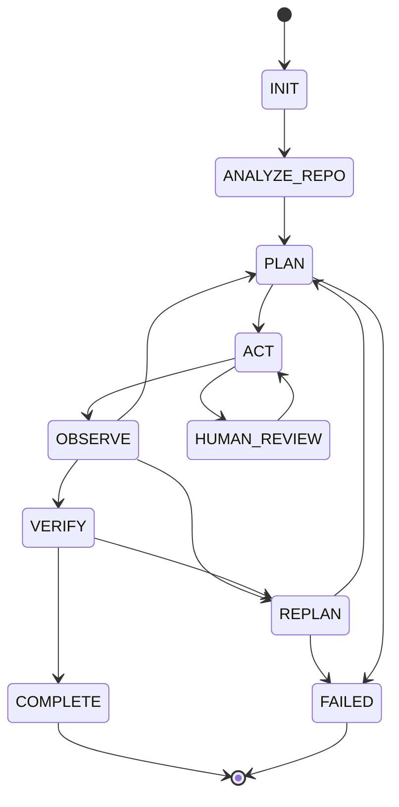
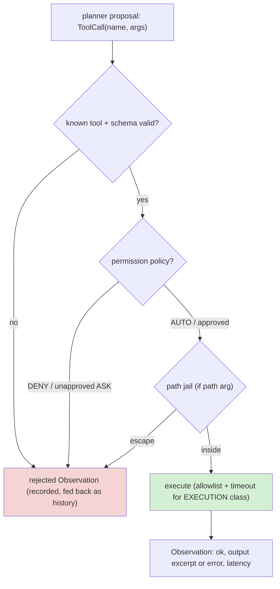
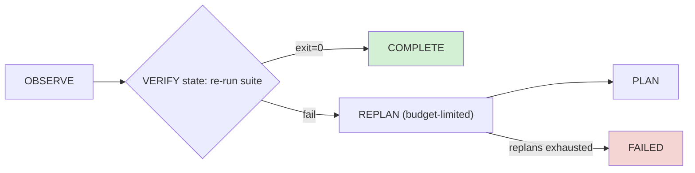
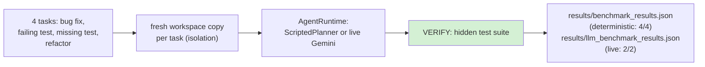

# repo-engineer: Autonomous Repository Engineer

A verified tool-using coding agent. Given a small repository and an engineering
task, it inspects the repo, plans, edits files through validated tools, runs
the test suite, observes failures, replans, and only declares success when the
verification suite is green.

```
INIT -> ANALYZE_REPO -> PLAN -> ACT -> OBSERVE -+-> PLAN (next step)
                                                |-> REPLAN (tests failed)
                                                +-> VERIFY -> COMPLETE / FAILED
```

The core design rule: **the planner proposes, the runtime disposes.** The LLM
(or scripted policy) only ever emits tool-call proposals. A deterministic state
machine validates every call against a schema, checks permissions, jails every
path inside the workspace, enforces step/replan budgets, and trusts nothing
except the test suite.

## Why it matters

Most "AI agent" demos break in one of three ways: they parse free-text tool
calls until the model hallucinates a syntax error, they give the model a shell
prompt, or they accept the model's word that the bug is fixed. This project
addresses all three explicitly:

| Failure mode | Defense in this repo |
|---|---|
| Malformed tool call | `ToolSpec` schema validation; rejects with structured errors recorded in the trace |
| Arbitrary shell access | no shell tool; `run_tests` allowlists command prefixes, runs without a shell, with timeout |
| Unverified claims | VERIFY state re-runs the suite; COMPLETE requires `exit=0` evidence |
| Path escapes / prompt injection via file content | workspace jail on every path argument; tool outputs are data, never instructions |
| Infinite loops | step budget + replan budget -> FAILED |

## Two benchmark modes, recorded separately

**Deterministic mode (reproducible).** `python scripts/run_benchmark.py`
runs four software-engineering tasks in isolated workspace copies with the
ScriptedPlanner. No network, no API keys, byte-stable. It measures the runtime:
validation, jail, permissions, state machine, verification.

| task | success | steps | replans | failed tool calls |
|---|---|---|---|---|
| fix off-by-one loop | yes | 5 | 0 | 0 |
| repair failing test | yes | 5 | 1 | 0 |
| add missing test | yes | 5 | 0 | 0 |
| constrained refactor | yes | 7 | 0 | 0 |

Committed in `results/benchmark_results.json`.

**Real LLM mode.** `python scripts/run_llm_benchmark.py` runs selected tasks
with `LLMPlanner` (gemini-2.5-flash via an OpenAI-compatible endpoint,
temperature 0). The model sees the task, the tool schemas and the truncated
history, and answers with a JSON tool call; the runtime validates, jails and
permission-checks every proposal and still requires a green test suite to
declare COMPLETE. Measured run (2026-09-16), committed in
`results/llm_benchmark_results.json`:

| task | success | steps | LLM calls | failed tool calls | notes |
|---|---|---|---|---|---|
| fix off-by-one loop | yes | 5 | 4 | 0 | edited only shop/cart.py |
| add missing test | yes | 4 | 7 | 0 | wrote its own test file; 2 provider 429s absorbed by the runtime |

The two 429 rate-limit errors mid-run are part of the record: the state
machine treated them as recoverable planner errors and still completed with
verified tests. API keys come from environment variables and are never
written to traces or results.

## Architecture



## Tool call pipeline (every proposal passes all gates)



## Verification: the only exit to COMPLETE



A planner claiming success changes nothing: COMPLETE is reachable only from
VERIFY, and VERIFY re-runs the test suite through the allowlisted tool.

## Benchmark flow (deterministic and live modes)



Deterministic results and live-LLM results are recorded in separate files and
never mixed.

Components (src/repo_engineer/):

- `state.py` - `State` enum, legal-transition table, serializable `AgentState`,
  `StateMachine` with step/replan budgets.
- `tools.py` - `ToolSpec` schema + `ToolRegistry`: `list_tree`, `search`,
  `read_file`, `apply_edit`, `write_file`, `git_diff`, `run_tests`. Permission
  classes (READ_ONLY / MUTATING / EXECUTION) with AUTO / ASK / DENY policies,
  workspace path jail, test-command allowlist, subprocess timeouts.
- `planner.py` - `Planner` ABC; `ScriptedPlanner` (deterministic recipes, used
  by the benchmark) and `LLMPlanner` (documented stub that requires explicit
  environment configuration).
- `agent.py` - `AgentRuntime`: the loop described above, plus JSON trace export.
- `benchmark/harness.py` + `benchmark/tasks/` - four self-contained mini-repos
  (bug fix, failing test, missing test, refactor) with hidden test suites.

## Technical Report

A concise IEEE-style technical paper documenting this system is available at
[reports/Autonomous_Repository_Engineer.pdf](reports/Autonomous_Repository_Engineer.pdf),
with LaTeX source included under `reports/`.

## Honest limitations

- Deterministic vs LLM modes measure different things and are stored in
  different files: `benchmark_results.json` (scripted, reproducible) vs
  `llm_benchmark_results.json` (live model, varies with provider and model
  version). The deterministic mode remains the regression harness; the LLM
  mode demonstrates end-to-end capability. Small-n caveat: the LLM benchmark
  covers two tasks, once each - it is a demonstration, not a leaderboard.
- The path jail is per-path-argument; the test suite exercises escape attempts
  (`..`, absolute paths, drive letters) but a production system would sandbox
  at the OS level too.
- Sequential file edits are the only mutation model; there is no multi-file
  transactional rollback (the trace records every change for manual review).

## Reproducibility

```bash
python -m pip install -e ".[dev]"
python -m pytest tests/ -q           # 16 tests
python scripts/run_benchmark.py      # 4/4 tasks, writes results/benchmark_results.json
```

Environment: Python >= 3.10, no third-party runtime dependencies (stdlib +
pytest only).

## Project structure

```
src/repo_engineer/       state.py tools.py planner.py agent.py benchmark/
benchmark/tasks/         four self-contained task repos (task.json + code + tests)
tests/                   16 tests: state machine, schemas, jail, policy, harness
results/                 committed benchmark output
docs/                    interview_guide.md, architecture.md
```

## License

MIT. See LICENSE.
