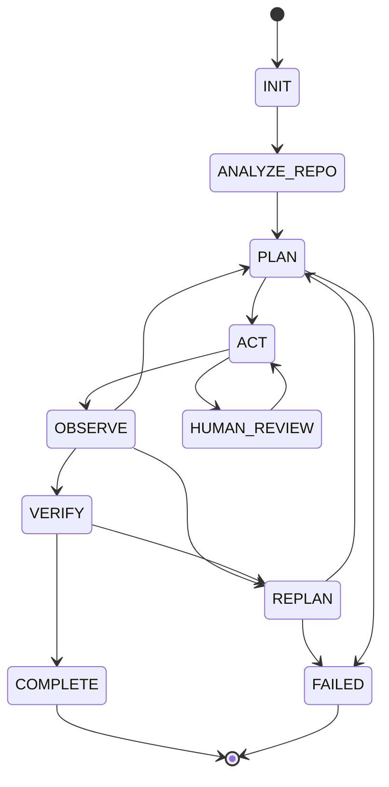

# repo-engineer: Architecture

## System overview

The runtime is a deterministic state machine; the planner (scripted recipes or
a live LLM) only proposes actions. Every proposal passes through the same
three gates before execution: tool-schema validation, permission policy, and
the workspace path jail. Completion requires a green verification suite.



## Module map

| Module | Responsibility | Key exports |
|---|---|---|
| `state.py` | States, legal transitions, serializable agent state, budgets | `State`, `TRANSITIONS`, `StateMachine`, `AgentState`, `ToolCall`, `Observation` |
| `tools.py` | Tool schemas, validation, permission policy, workspace jail, subprocess execution | `ToolRegistry`, `ToolSpec`, `Permission`, `Policy` |
| `planner.py` | Action proposal: deterministic recipes, live LLM, recorded replay | `Planner`, `ScriptedPlanner`, `LLMPlanner`, `RecordedPlanner` |
| `llm_provider.py` | OpenAI-compatible chat client (stdlib only) | `OpenAICompatProvider`, `LLMResponse` |
| `agent.py` | The runtime loop, verification, trace export | `AgentRuntime`, `prepare_workspace` |
| `benchmark/harness.py` | Task suite runner with per-run workspace isolation | `run_benchmark`, `load_tasks` |

## Tool call pipeline

```
planner proposal (ToolCall)
  -> known tool?            no -> rejected Observation
  -> schema valid?          no -> rejected Observation
  -> permission policy?     DENY / unapproved ASK -> rejected Observation
  -> path jail (if path arg) escape -> rejected Observation
  -> execute (subprocess rules for EXECUTION class)
  -> Observation(ok, output_excerpt | error, latency)
```

Rejected calls never crash the runtime; they are recorded in the trace and fed
back to the planner as history.

## Verification rule

`COMPLETE` is reachable only from `VERIFY`, and `VERIFY` re-runs the test
suite through the allowlisted `run_tests` tool. The transition is taken only
when the observation ends with `exit=0`. A planner claiming success changes
nothing: `OBSERVE --(tests fail)--> REPLAN` until the replan budget is
exhausted, then `FAILED`.
